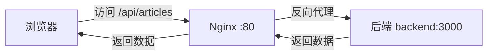

# 前端 API 地址配置问题解决方案

## 🔍 问题描述

前端访问后端时使用了 `http://localhost:3000`,导致在生产环境中无法正常访问后端 API。

**错误表现:**
- 前端请求: `http://localhost:3000/articles?page=1&limit=10`
- 应该请求: `http://106.14.179.11:3000/articles?page=1&limit=10`

---

## ✅ 解决方案:Nginx 反向代理(已实施)

### 方案优势

✅ **无需暴露后端端口** - 更安全  
✅ **避免跨域问题** - 前后端同域  
✅ **统一入口** - 所有请求通过 80 端口  
✅ **易于维护** - 无需修改前端代码中的 IP 地址  

### 工作原理



**请求流程:**
1. 前端发起请求: `http://www.fbranch.top/api/articles?page=1&limit=10`
2. Nginx 接收请求,去掉 `/api` 前缀
3. 转发到后端: `http://backend:3000/articles?page=1&limit=10`
4. 后端处理并返回数据
5. Nginx 返回给前端

---

## 📝 已修改的配置

### 1. Nginx 配置 ([nginx.conf](file:///c:/MyFile/Projects/javascript/yjl-blog-demo/yjl-blog-frontend-demo/nginx.conf))

```nginx
# API 反向代理 - 将 /api 请求转发到后端服务
location /api {
    # 重写路径,去掉 /api 前缀
    rewrite ^/api/(.*) /$1 break;
    
    # 代理到后端服务
    proxy_pass http://backend:3000;
    
    # 代理头设置
    proxy_http_version 1.1;
    proxy_set_header Upgrade $http_upgrade;
    proxy_set_header Connection 'upgrade';
    proxy_set_header Host $host;
    proxy_set_header X-Real-IP $remote_addr;
    proxy_set_header X-Forwarded-For $proxy_add_x_forwarded_for;
    proxy_set_header X-Forwarded-Proto $scheme;
    
    # 超时设置
    proxy_connect_timeout 60s;
    proxy_send_timeout 60s;
    proxy_read_timeout 60s;
}
```

### 2. Dockerfile 环境变量 ([Dockerfile](file:///c:/MyFile/Projects/javascript/yjl-blog-demo/yjl-blog-frontend-demo/Dockerfile))

```dockerfile
# 设置构建时环境变量
ARG VITE_API_BASE_URL=/api
ENV VITE_API_BASE_URL=$VITE_API_BASE_URL

# 构建生产版本
RUN npm run build
```

---

## 🚀 部署步骤

### 方法一:重新构建并部署(推荐)

由于修改了 Nginx 配置和 Dockerfile,需要重新构建镜像:

```bash
# 1. 提交代码到 Git
git add .
git commit -m "修复前端 API 地址配置,添加 Nginx 反向代理"
git push origin main

# 2. GitHub Actions 会自动构建新镜像并部署
# 查看部署进度: https://github.com/你的用户名/仓库名/actions
```

### 方法二:手动重新构建

如果不想等待 CI/CD,可以手动操作:

```bash
# 在本地构建新镜像
cd c:\MyFile\Projects\javascript\yjl-blog-demo\yjl-blog-frontend-demo
docker build -t 你的Docker用户名/blog-frontend:latest .

# 推送到 Docker Hub
docker push 你的Docker用户名/blog-frontend:latest

# SSH 到服务器
ssh user@106.14.179.11

# 在服务器上更新
cd /opt/blog/blog-demo
docker-compose pull frontend
docker-compose up -d frontend
```

---

## 🔧 前端代码调整(可选)

前端代码中的 API 配置已经支持环境变量,无需修改:

```typescript
// src/config/server.ts
export const serverConfig: ServerConfig = {
  baseURL: import.meta.env.VITE_API_BASE_URL || 'http://localhost:3000',
  // ...
}
```

**环境变量说明:**
- **开发环境**: 使用 `http://localhost:3000`(直接访问后端)
- **生产环境**: 使用 `/api`(通过 Nginx 反向代理)

---

## ✅ 验证步骤

部署完成后,请验证:

### 1. 检查 Nginx 配置

```bash
# SSH 到服务器
ssh user@106.14.179.11

# 进入前端容器
docker exec -it blog-frontend sh

# 查看 Nginx 配置
cat /etc/nginx/conf.d/default.conf

# 测试配置是否正确
nginx -t

# 退出容器
exit
```

### 2. 测试 API 访问

打开浏览器开发者工具(F12),访问你的网站:

```
http://www.fbranch.top
```

查看 Network 标签,API 请求应该是:
```
✅ http://www.fbranch.top/api/articles?page=1&limit=10
❌ http://localhost:3000/articles?page=1&limit=10
```

### 3. 测试后端连接

```bash
# 直接测试反向代理
curl http://www.fbranch.top/api/articles?page=1&limit=10

# 应该返回文章数据
```

---

## 🐛 常见问题

### Q1: 重新部署后仍然访问 localhost?

**原因**: 浏览器缓存了旧的 JavaScript 文件

**解决方案**:
```bash
# 清除浏览器缓存
Ctrl + Shift + Delete

# 或强制刷新
Ctrl + F5
```

### Q2: API 请求返回 502 Bad Gateway?

**原因**: 后端服务未启动或网络不通

**检查步骤**:
```bash
# 检查后端容器状态
docker-compose ps backend

# 查看后端日志
docker-compose logs backend

# 检查网络连接
docker exec blog-frontend ping backend
```

### Q3: API 请求返回 404?

**原因**: Nginx 路径重写配置问题

**检查**:
```bash
# 查看 Nginx 错误日志
docker-compose logs frontend | grep error

# 测试后端直接访问
docker exec blog-backend curl http://localhost:3000/articles?page=1&limit=10
```

---

## 📊 架构对比

### 修改前(有问题)

```
浏览器 → http://localhost:3000/articles ❌ (无法访问)
```

### 修改后(正常)

```
浏览器 → http://www.fbranch.top/api/articles
         ↓
      Nginx (去掉 /api)
         ↓
      http://backend:3000/articles ✅
```

---

## 🎯 其他解决方案(备选)

### 方案二:直接暴露后端端口

如果不想使用反向代理,可以:

1. **修改 docker-compose.yml**:
```yaml
backend:
  ports:
    - "3000:3000"  # 暴露后端端口
```

2. **修改前端环境变量**:
```env
VITE_API_BASE_URL=http://106.14.179.11:3000
```

**缺点**:
- ⚠️ 需要暴露额外端口
- ⚠️ 可能有跨域问题
- ⚠️ 安全性较低

---

## 📚 参考资料

- [Nginx 反向代理文档](http://nginx.org/en/docs/http/ngx_http_proxy_module.html)
- [Vite 环境变量](https://vitejs.dev/guide/env-and-mode.html)
- [Docker 网络](https://docs.docker.com/network/)

---

**现在你的前端应该可以正常访问后端了! 🎉**
