# 博客 CI/CD 自动化部署文档

## 📋 目录
- [快速开始](#快速开始)
- [配置步骤](#配置步骤)
- [使用说明](#使用说明)
- [常见问题](#常见问题)

---

## 🚀 快速开始

本项目已配置完整的 CI/CD 自动化部署流程,只需完成一次性配置后,每次推送代码到 GitHub 即可自动部署到服务器。

### 工作流程

```mermaid
graph LR
    A[推送代码到 GitHub] --> B[GitHub Actions 自动触发]
    B --> C[构建 Docker 镜像]
    C --> D[推送到 Docker Hub]
    D --> E[SSH 连接服务器]
    E --> F[拉取最新镜像]
    F --> G[重启服务]
    G --> H[部署完成]
```



---

## ⚙️ 配置步骤

### 1. 准备工作

#### 1.1 创建 Docker Hub 账号
1. 访问 [Docker Hub](https://hub.docker.com/) 注册账号
2. 记录你的用户名和密码

#### 1.2 服务器准备
确保服务器已安装:
- Docker
- Docker Compose

**安装命令(Ubuntu/Debian):**
```bash
# 安装 Docker
curl -fsSL https://get.docker.com -o get-docker.sh
sudo sh get-docker.sh

# 安装 Docker Compose
sudo apt-get update
sudo apt-get install docker-compose-plugin

# 验证安装
docker --version
docker compose version
```

---

### 2. 配置 GitHub Secrets

在 GitHub 仓库中配置以下 Secrets:

1. 进入 GitHub 仓库 → **Settings** → **Secrets and variables** → **Actions**
2. 点击 **New repository secret** 添加以下密钥:

| Secret 名称 | 说明 | 示例 |
|------------|------|------|
| `DOCKER_USERNAME` | Docker Hub 用户名 | `yourname` |
| `DOCKER_PASSWORD` | Docker Hub 密码 | `your_password` |
| `SERVER_HOST` | 服务器 IP 地址 | `192.168.1.100` |
| `SERVER_USER` | SSH 用户名 | `root` 或 `ubuntu` |
| `SERVER_SSH_KEY` | SSH 私钥 | 见下方说明 |

#### 2.1 生成 SSH 密钥

**在本地电脑执行:**
```bash
# 生成 SSH 密钥对
ssh-keygen -t rsa -b 4096 -C "github-actions"

# 查看公钥(复制到服务器)
cat ~/.ssh/id_rsa.pub

# 查看私钥(复制到 GitHub Secrets)
cat ~/.ssh/id_rsa
```

**在服务器上执行:**
```bash
# 将公钥添加到服务器
echo "你的公钥内容" >> ~/.ssh/authorized_keys
chmod 600 ~/.ssh/authorized_keys
```

---

### 3. 服务器配置

#### 3.1 创建项目目录
```bash
# 创建项目目录
sudo mkdir -p /opt/blog
cd /opt/blog

# 克隆仓库(或手动上传文件)
git clone https://github.com/你的用户名/yjl-blog-demo.git .
```

#### 3.2 配置环境变量
```bash
# 复制环境变量模板
cp .env.example .env

# 编辑环境变量
nano .env
```

**修改 `.env` 文件中的敏感信息:**
```env
MYSQL_ROOT_PASSWORD=你的安全密码
MYSQL_DATABASE=blog_db
MYSQL_USER=blog_user
MYSQL_PASSWORD=你的数据库密码
JWT_SECRET=你的JWT密钥
```

#### 3.3 修改 docker-compose.yml

将 `docker-compose.yml` 中的镜像名称改为你的 Docker Hub 用户名:

```yaml
backend:
  image: 你的Docker用户名/blog-backend:latest
  # ... 其他配置保持不变

frontend:
  image: 你的Docker用户名/blog-frontend:latest
  # ... 其他配置保持不变
```

#### 3.4 首次启动
```bash
# 首次启动(会自动拉取镜像)
docker-compose up -d

# 查看日志
docker-compose logs -f
```

---

### 4. 修改 GitHub Actions 工作流

编辑 `.github/workflows/deploy.yml`,将镜像名称改为你的 Docker Hub 用户名:

```yaml
# 将所有的 ${{ secrets.DOCKER_USERNAME }} 替换为你的实际用户名
# 或者保持不变,使用 secrets 变量
```

---

## 📖 使用说明

### 自动部署

配置完成后,只需:
```bash
git add .
git commit -m "更新代码"
git push origin main
```

GitHub Actions 会自动:
1. ✅ 构建前端和后端 Docker 镜像
2. ✅ 推送镜像到 Docker Hub
3. ✅ SSH 连接到服务器
4. ✅ 拉取最新镜像并重启服务

### 查看部署状态

1. 在 GitHub 仓库中点击 **Actions** 标签
2. 查看最新的工作流运行状态
3. 点击具体的工作流查看详细日志

### 手动部署

如果需要手动部署,在服务器上执行:
```bash
cd /opt/blog
./deploy.sh
```

---

## 🔧 常见问题

### Q1: GitHub Actions 构建失败?

**检查清单:**
- ✅ 确认所有 GitHub Secrets 已正确配置
- ✅ 检查 Docker Hub 用户名和密码是否正确
- ✅ 查看 Actions 日志中的具体错误信息

### Q2: SSH 连接服务器失败?

**解决方案:**
```bash
# 在服务器上检查 SSH 配置
sudo nano /etc/ssh/sshd_config

# 确保以下配置已启用:
PubkeyAuthentication yes
PasswordAuthentication no

# 重启 SSH 服务
sudo systemctl restart sshd
```

### Q3: 服务器拉取镜像失败?

**解决方案:**
```bash
# 手动登录 Docker Hub
docker login

# 手动拉取镜像测试
docker pull 你的用户名/blog-backend:latest
```

### Q4: 容器启动失败?

**检查步骤:**
```bash
# 查看容器状态
docker-compose ps

# 查看容器日志
docker-compose logs backend
docker-compose logs frontend

# 检查环境变量
cat .env
```

### Q5: 数据库连接失败?

**解决方案:**
```bash
# 进入 MySQL 容器
docker exec -it blog-mysql mysql -u root -p

# 检查数据库和用户
SHOW DATABASES;
SELECT user, host FROM mysql.user;

# 如果需要重新创建用户
CREATE USER 'blog_user'@'%' IDENTIFIED BY 'your_password';
GRANT ALL PRIVILEGES ON blog_db.* TO 'blog_user'@'%';
FLUSH PRIVILEGES;
```

---

## 🎯 进阶配置

### 配置 HTTPS

使用 Nginx + Let's Encrypt 配置 HTTPS:

```bash
# 安装 Certbot
sudo apt-get install certbot python3-certbot-nginx

# 获取证书
sudo certbot --nginx -d yourdomain.com
```

### 配置多环境部署

创建不同的分支对应不同环境:
- `main` → 生产环境
- `develop` → 开发环境
- `staging` → 测试环境

修改 `.github/workflows/deploy.yml`:
```yaml
on:
  push:
    branches:
      - main      # 生产环境
      - develop   # 开发环境
```

### 添加健康检查

在 `docker-compose.yml` 中添加:
```yaml
backend:
  healthcheck:
    test: ["CMD", "curl", "-f", "http://localhost:3000/health"]
    interval: 30s
    timeout: 10s
    retries: 3
```

---

## 📞 技术支持

如有问题,请:
1. 查看 GitHub Actions 日志
2. 检查服务器日志: `docker-compose logs -f`
3. 参考本文档的常见问题部分

---

## 📝 更新日志

- **2025-12-18**: 初始版本,完成 CI/CD 自动化部署配置
