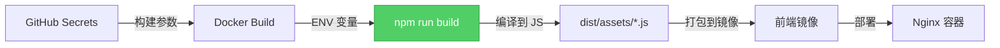

# 前端 MinIO 环境变量问题修复

## 🚨 问题现象

上传图片后,图片 URL 显示为:
```
http://undefined:undefined/blog-images/xxx.jpg
```

前端无法显示图片。

---

## 🔍 问题原因

**前端是静态构建的,环境变量必须在构建时注入,而不是运行时!**

### 错误的做法(运行时注入)

```yaml
# docker-compose.yml
frontend:
  environment:
    VITE_MINIO_ENDPOINT: ${SERVER_HOST}  # ❌ 无效!
    VITE_MINIO_PORT: ${MINIO_PORT}       # ❌ 无效!
```

**为什么无效?**
- 前端在构建时(`npm run build`)就已经把所有环境变量编译到 JavaScript 文件中了
- 运行时注入的环境变量前端代码无法读取
- 结果:`import.meta.env.VITE_MINIO_ENDPOINT` 返回 `undefined`

---

## ✅ 解决方案

### 1. 在 Dockerfile 中添加构建参数

```dockerfile
# 前端 Dockerfile
ARG VITE_MINIO_ENDPOINT
ARG VITE_MINIO_PORT
ARG VITE_MINIO_ACCESS_KEY
ARG VITE_MINIO_SECRET_KEY
ARG VITE_MINIO_BUCKET

ENV VITE_MINIO_ENDPOINT=$VITE_MINIO_ENDPOINT
ENV VITE_MINIO_PORT=$VITE_MINIO_PORT
# ... 其他变量

RUN npm run build  # ← 构建时读取环境变量
```

### 2. 在 GitHub Actions 中传递构建参数

```yaml
# .github/workflows/deploy.yml
- name: 构建并推送前端镜像
  uses: docker/build-push-action@v5
  with:
    build-args: |
      VITE_API_BASE_URL=${{ secrets.VITE_API_BASE_URL }}
      VITE_MINIO_ENDPOINT=${{ secrets.SERVER_HOST }}
      VITE_MINIO_PORT=${{ secrets.MINIO_PORT }}
      VITE_MINIO_ACCESS_KEY=${{ secrets.MINIO_ACCESS_KEY }}
      VITE_MINIO_SECRET_KEY=${{ secrets.MINIO_SECRET_KEY }}
      VITE_MINIO_BUCKET=${{ secrets.MINIO_BUCKET }}
```

### 3. 添加 GitHub Secret

需要添加一个新的 Secret:

```
名称: MINIO_PORT
值: 9000
```

---

## 🎯 完整流程



**关键点:**
1. ✅ GitHub Secrets → Docker build-args
2. ✅ build-args → Dockerfile ENV
3. ✅ ENV → Vite 构建时读取
4. ✅ 编译到 JavaScript 文件
5. ✅ 前端可以正常使用

---

## 📝 需要配置的 GitHub Secrets

| Secret 名称 | 值 | 说明 |
|------------|-----|------|
| `SERVER_HOST` | `106.14.179.11` | 服务器 IP(前端访问 MinIO 用) |
| `MINIO_PORT` | `9000` | MinIO API 端口 |
| `MINIO_ACCESS_KEY` | 你的密钥 | MinIO 访问密钥 |
| `MINIO_SECRET_KEY` | 你的密钥 | MinIO 密钥 |
| `MINIO_BUCKET` | `blog-images` | 存储桶名称 |

---

## 🚀 部署步骤

1. **添加 MINIO_PORT Secret:**
   - GitHub 仓库 → Settings → Secrets → New secret
   - 名称:`MINIO_PORT`
   - 值:`9000`

2. **推送代码触发部署:**
```bash
git add .
git commit -m "修复:前端 MinIO 环境变量配置"
git push origin master
```

3. **等待构建完成**
   - GitHub Actions 会重新构建前端镜像
   - 构建时注入 MinIO 配置
   - 自动部署到服务器

---

## ✅ 验证

部署完成后,上传图片应该显示正确的 URL:

```javascript
// 之前(错误)
url: http://undefined:undefined/blog-images/xxx.jpg

// 之后(正确)
url: http://106.14.179.11:9000/blog-images/xxx.jpg
```

---

## 💡 关键理解

**前端环境变量的两种类型:**

| 类型 | 注入时机 | 配置位置 | 适用场景 |
|------|---------|---------|---------|
| **构建时变量** | `npm run build` | Dockerfile ARG/ENV | ✅ Vite/Vue/React 等 SPA |
| **运行时变量** | `docker run` | docker-compose environment | ❌ 前端无法读取 |

**记住:**
- 前端 = 静态文件 = 构建时注入
- 后端 = 运行时进程 = 运行时注入

---

**现在推送代码,重新构建镜像即可解决问题!** 🎉
